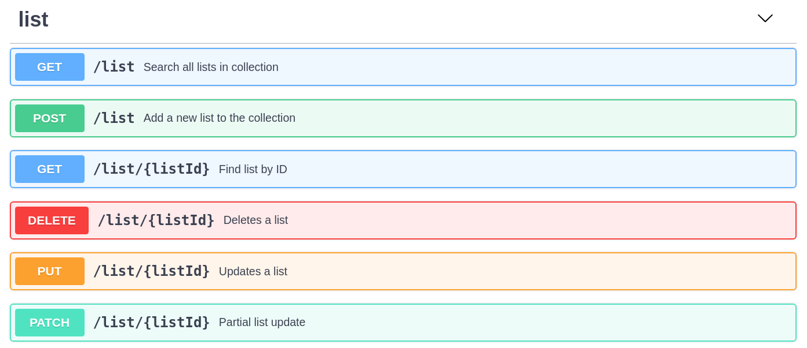
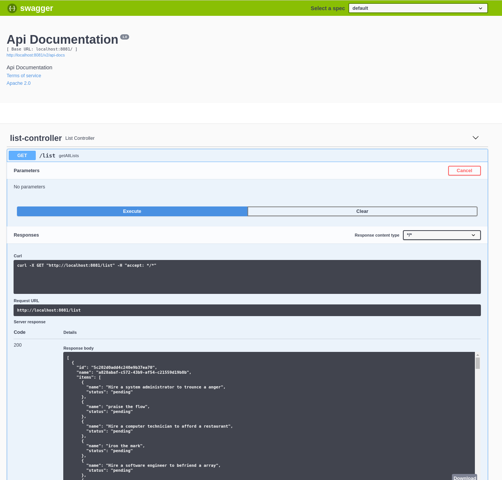
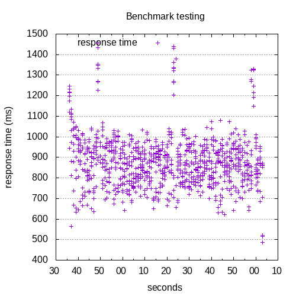

# List of items TODO 

### Requirements

1. Maintain a list of items to complete, or have been completed
1. List can be modified or deleted, adding new items or removing items
1. Items on the list may be individually updated

### Swagger contract



### Environment configuration

The application uses mongo.  Start a mongo server with Docker, run the following:

```
docker run -p 27017:27017 mongo
```

Seed the database with the following gradle task:

```
./gradlew generate
``` 

Check the file `application-generator.properties` to configure the generator limits.  


### Running the Application

Under developer mode, the Spring Boot application makes use of dev-tools.  This allows the application to be restarted without requiring a JVM restart.

```
./gradlew bootRun
```

To build and run a fat jar, invoke the following:

```
./gradlew clean build bootJar
java -jar ./build/libs/application-1.0.jar
```

### Testing the Application

Embedded in the application is the tool swagger-ui that renders a page that can be used to invoke the application endpoints from the application itself.  This page is dynamic and changes as the application changes under development.

After starting the application, visit the following URL:

[http://localhost:8081/swagger-ui.html](http://localhost:8081/swagger-ui.html)

You should see something like the following:




### Benchmarking

The Apache HTTP server benchmarking tool was used for conducting stress-tests.

You will need to install ab, and gnuplot.


```
$ ./gradlew bench graph
  
  > Task :bench 
  This is ApacheBench, Version 2.3 <$Revision: 1807734 $>
  Copyright 1996 Adam Twiss, Zeus Technology Ltd, http://www.zeustech.net/
  Licensed to The Apache Software Foundation, http://www.apache.org/
  
  Benchmarking localhost (be patient)
  Completed 100 requests
  Completed 200 requests
  Completed 300 requests
  Completed 400 requests
  Completed 500 requests
  Completed 600 requests
  Completed 700 requests
  Completed 800 requests
  Completed 900 requests
  Completed 1000 requests
  Finished 1000 requests
  
  
  Server Software:        
  Server Hostname:        localhost
  Server Port:            8081
  
  Document Path:          /list
  Document Length:        9967287 bytes
  
  Concurrency Level:      10
  Time taken for tests:   88.027 seconds
  Complete requests:      1000
  Failed requests:        0
  Total transferred:      9967399000 bytes
  HTML transferred:       9967287000 bytes
  Requests per second:    11.36 [#/sec] (mean)
  Time per request:       880.271 [ms] (mean)
  Time per request:       88.027 [ms] (mean, across all concurrent requests)
  Transfer rate:          110577.14 [Kbytes/sec] received
  
  Connection Times (ms)
                min  mean[+/-sd] median   max
  Connect:        0    0   0.0      0       0
  Processing:   424  878 126.5    872    1458
  Waiting:      423  876 126.3    871    1456
  Total:        424  878 126.5    872    1458
  
  Percentage of the requests served within a certain time (ms)
    50%    872
    66%    919
    75%    943
    80%    959
    90%   1004
    95%   1069
    98%   1269
    99%   1333
   100%   1458 (longest request)
  
  
  BUILD SUCCESSFUL in 1m 28s
  2 actionable tasks: 2 executed

```

See the folder `./bench/` for the benchmark data, and `./bench/graphs/` for gnuplots.

The graph below was taken against localhost, with a mongo document collection of 10000.

_The ab benchmarking tool was configured to send 1000 requests with atmost 10 in-flight._


